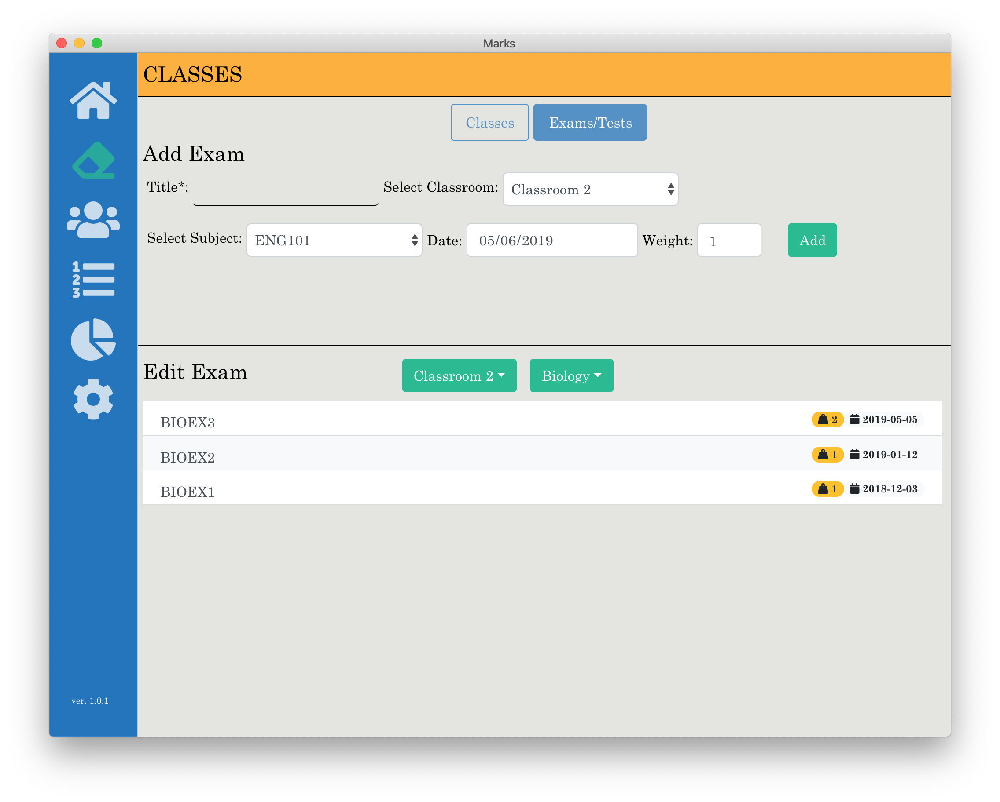

GitHub Pages: https://hcuffy.github.io/Marks/

Buymeacoffee: https://www.buymeacoffee.com/marksApp

## Installation

First, clone the repo via git:

```bash
git clone https://github.com/hcuffy/Marks
```

Then install the dependencies with yarn.

```bash
$ cd Marks
$ yarn
```

Then to launch the app

```bash
$ yarn start
```

## A Quick Look


  


Developed using [**electron-react-boilerplate**](https://github.com/electron-react-boilerplate/electron-react-boilerplate)
